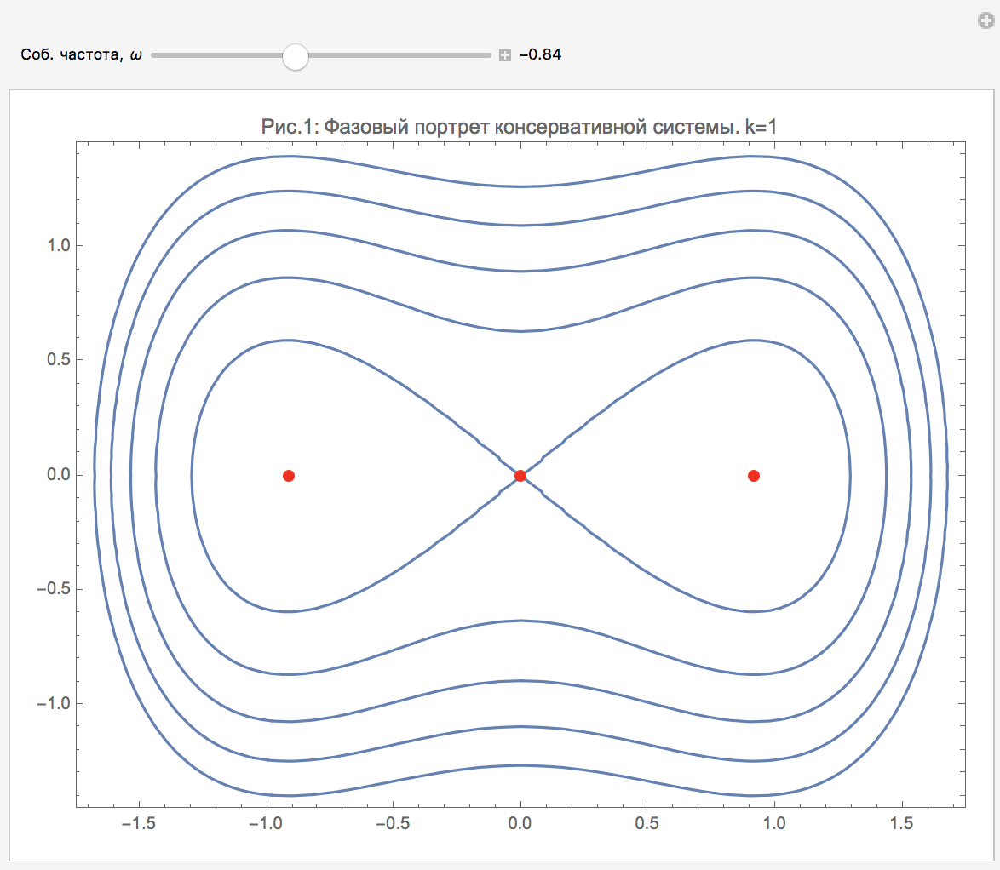
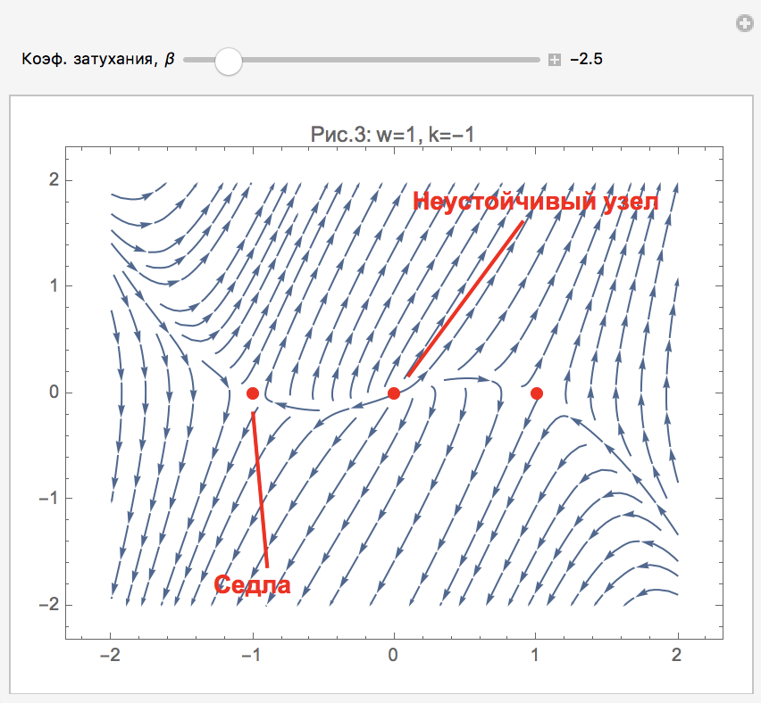
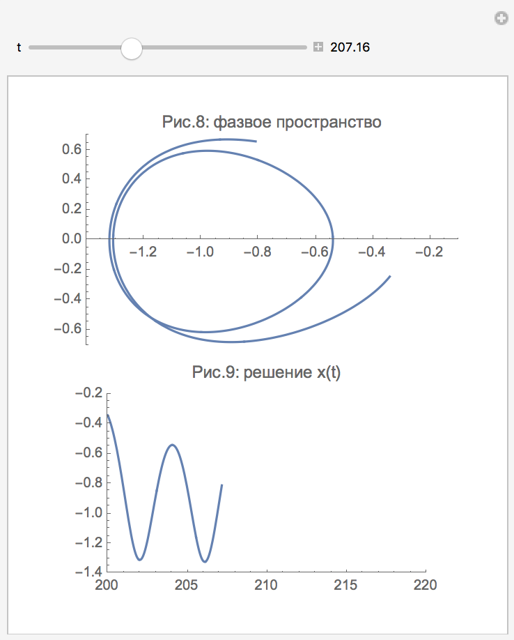
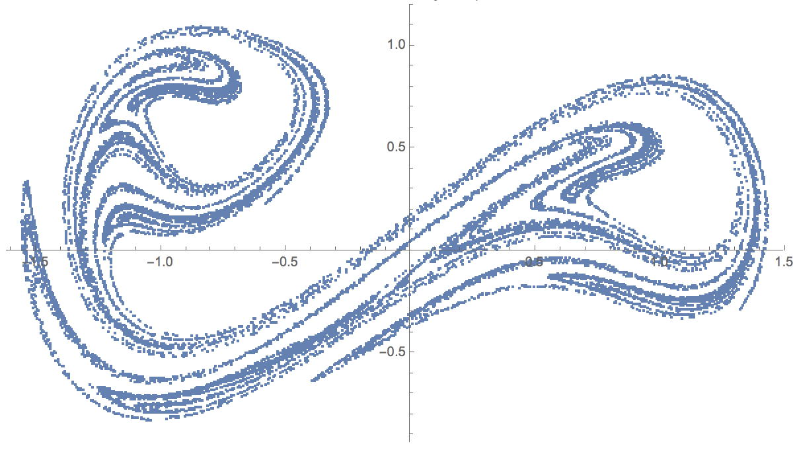
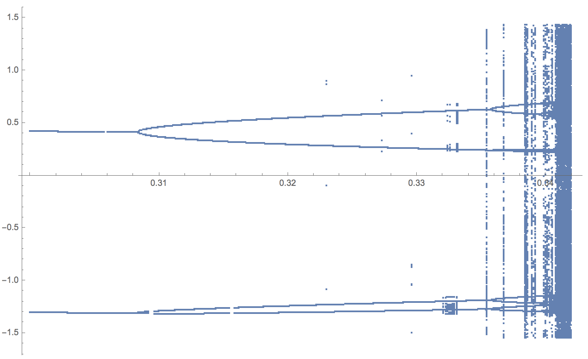

# Осциллятор Дуффинга

В данной работе проводится качественный анализ свойств нелинейного осциллятора Дуффинга. Первая часть посвящена колебаниям без вынуждающей силы. Уравнение в таком случае принимает вид:

    

Рассморены положения равновесия как консервативной системы, так и системы при наличии диссипации. Каждая из визуализаций анимирована и позволяет отследить изменения типа положения равновесия при изменении одного из параметров:

<table align="center" style="width:100%" class="no-border">
  <tr>
    <th></th>
    <th></th>
  </tr>
</table>

Наиболее интересные свойства данного уравнения появляются при добавлении вынуждающей силы:

    

Наглядно показано явление удвоения прериода, построено сечение Пупнкаре и бифуркационная диаграмма.

<table align="center" style="width:100%" class="no-border">
  <tr>
    <th></th>
    <th></th>
    <th></th>
  </tr>
</table>

Все материалы, а также исходный код находятся в файле [duffing.nb](https://github.com/krashkov/DuffingOscillator/blob/master/duffing.nb).
